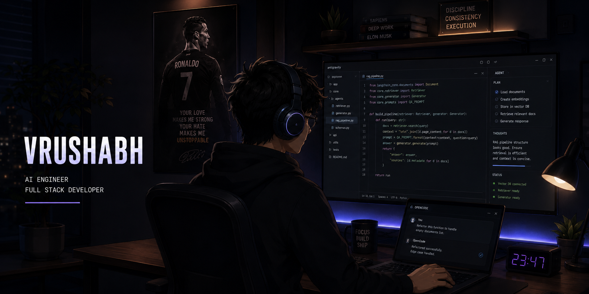

<br>

## Vrushabh Jain

**AI Engineer • Full Stack Developer**

Building AI systems with a focus on **Generative AI, LLM Applications, RAG Pipelines and scalable backend architectures.**

Experience working across the complete AI application lifecycle:
- Document Intelligence Systems
- Retrieval Augmented Generation (RAG)
- AI Agents & Workflow Automation
- Machine Learning Pipelines
- REST API based AI Services

---

## Tech Stack

```python
AI = [
    "LLMs",
    "LangChain",
    "LangGraph",
    "RAG",
    "FAISS",
    "Hugging Face",
    "TensorFlow"
]

Backend = [
    "FastAPI",
    "Flask",
    "PostgreSQL",
    "MongoDB",
    "Docker"
]

Languages = [
    "Python",
    "SQL",
    "JavaScript"
]
```

---

## Featured Work

**FinSage — AI Financial Intelligence Platform**

RAG powered financial assistant with vector search, market data integration and personalized insights.


**AI Document Intelligence System**

Automated document processing pipeline using OCR, LLM extraction and structured information retrieval.


---

## Certifications

🏆 **IBM Certified AI Engineer**

🥇 **NASSCOM Certified Data Analyst**  
Gold Category — 88%

🏅 **Data Science Certification**  
ExcelR Institute — Distinction

🏅 **Data Analyst Certification**  
ExcelR Institute — Distinction


---

```python
while building:
    learn()
    experiment()
    improve()
```
