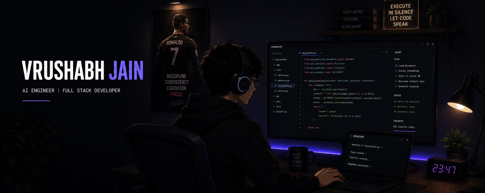

<p align="center">
  
</p>

<br>

## About

**IBM Certified AI Engineer** focused on building production-ready AI systems.

Working across **Generative AI, RAG pipelines, LLM applications and backend engineering** — combining AI models with scalable APIs and real-world software.

Currently exploring deeper into **AI Agents, LangGraph workflows and intelligent automation systems.**

---

## Tech Stack

```python
AI = ["LLMs", "RAG", "LangChain", "LangGraph", "FAISS", "TensorFlow"]

Backend = ["FastAPI", "Flask", "PostgreSQL", "MongoDB", "Docker"]

Core = ["Python", "SQL", "Machine Learning", "Deep Learning"]
```

---

## Featured Projects

**FinSage — AI Financial Intelligence Platform** 

**RAG based financial assistant with vector search, market data integration and portfolio intelligence.**

**AI Document Intelligence System**  

**OCR + LLM powered document understanding system with structured data extraction.**

---

## Certifications

🏆 IBM Certified AI Engineer  

🥇 NASSCOM Certified Data Analyst  
Gold Category • 88%

🏅 Data Science Certification  
ExcelR Institute • Distinction

🏅 Data Analyst Certification  
ExcelR Institute • Distinction


---

<p align="center">

Building. Breaking. Debugging.

</p>
